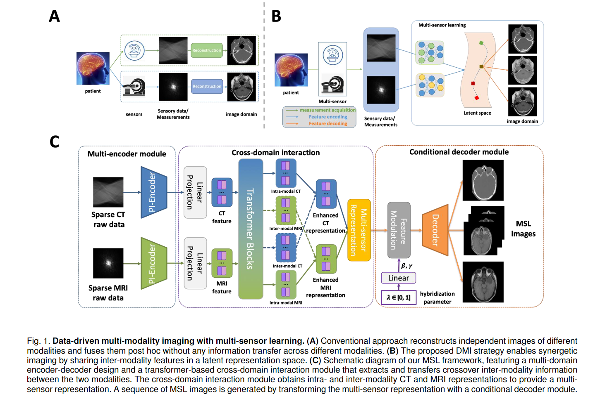

# Multi-sensor Learning Enables Information Transfer across Different Sensory Data and Augments Multi-modality Imaging (TPAMI 2024)


### Abstract

Multi-modality imaging is widely used in clinical practice and biomedical research to gain a comprehensive understanding of an imaging subject. Currently, multi-modality imaging is accomplished by post hoc fusion of independently reconstructed images under the guidance of mutual information or spatially registered hardware, which limits the accuracy and utility of multi-modality imaging. Here, we investigate a data-driven multi-modality imaging (DMI) strategy for synergetic imaging of CT and MRI. We reveal two distinct types of features in multi-modality imaging, namely intra- and inter-modality features, and present a multi-sensor learning (MSL) framework to utilize the crossover inter-modality features for augmented multi-modality imaging. The MSL imaging approach breaks down the boundaries of traditional imaging modalities and allows for optimal hybridization of CT and MRI, which maximizes the use of sensory data. We showcase the effectiveness of our DMI strategy through synergetic CT-MRI brain imaging. The principle of DMI is quite general and holds enormous potential for various DMI applications across disciplines.



### Get Started

1. Clone this repository and install packages:
    ```
    git clone https://github.com/HKU-MedAI/MSL
    pip install -r requirements.txt
    ```

2. Download data from the [link](https://rire.insight-journal.org/download_data.html).

3. Register all the paired modality data and save them as paired .nii files. Refer to `prepare_data/coregister.py`.
    ```
    cd code
    python ./prepare_data/coregister.py path_to_data
    ```

4. Process .nii files to obtain .npz files and .png files.
    ```
    python ./prepare_data/processing_data.py path_to_data
    ```

5. Prepare train and test split. The .npz and .png files should be splitted according to the patient id (*i.e.*, the prefix of the files like p001). Save them in `train` and `test` directories.

6. Run train.py to train the model and run test.py to get results.

### Citation

TBD.